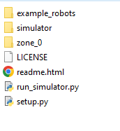
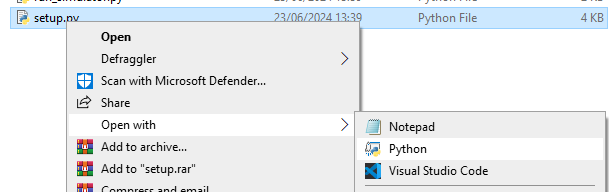
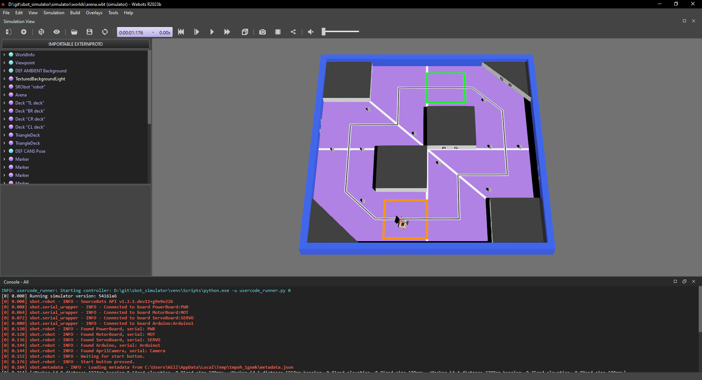
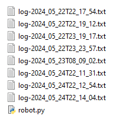

The sbot Simulator
---

The robotics simulator for sbot used by the SRO society, powered by Webots.

In order to use the simulator a few set-up steps need to be done.
First you need to install Python 3.9+ and Webots R2023b.

To install Python, you can download the latest version from the [Python website](https://www.python.org/downloads/). If you have already installed Python from a package manager, such as homebrew on MacOS, apt on Ubuntu, or the Windows store on Windows, you can skip this step.

To install Webots, you can download the latest version from the [Webots website](https://cyberbotics.com/#download). Use the default settings when installing Webots.

Once you have installed these, you can download the latest release from the releases page and extract the contents to a folder.

- setup
    - release download
        - download the latest release from the releases page
        - extract the contents to a folder
    - release contents
        - 
    - config script
        - right click, open with python
        - 
- where the code goes
    - zone_0 folder
    - must be called robot.py
    - other zones are available
    - use the sbot library
- how to run the simulator
    - startup script
    - UI elements
        - 
        - 3d world
        - logs in console
        - play/pause buttons
- where the logs are
    - location
        - 
    - naming
- improving performance
    - 
    - 
    - disable shadows
    - disable anti-aliasing
- common issues
    - remember to sleep
    - reopening the camera overlay
    - 
